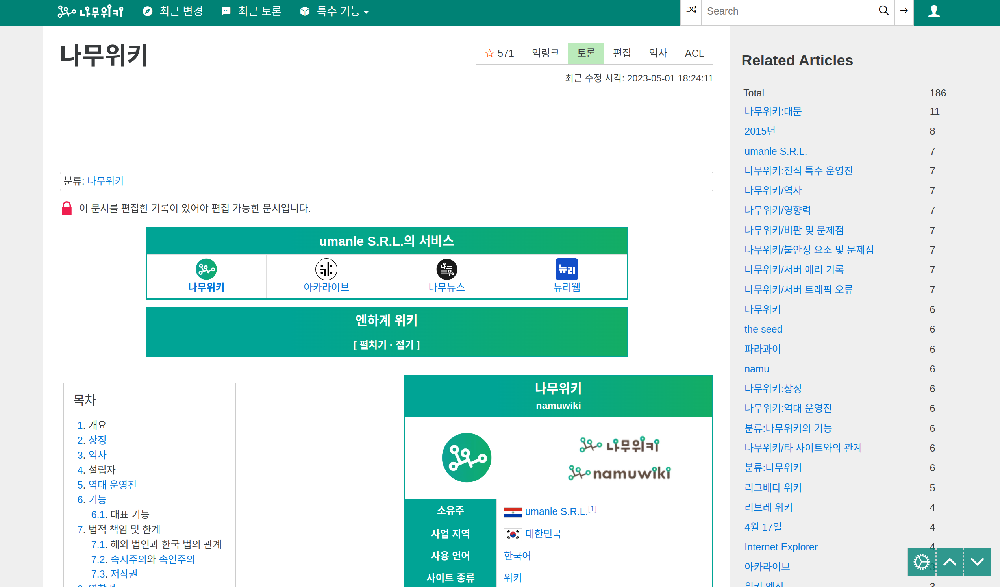
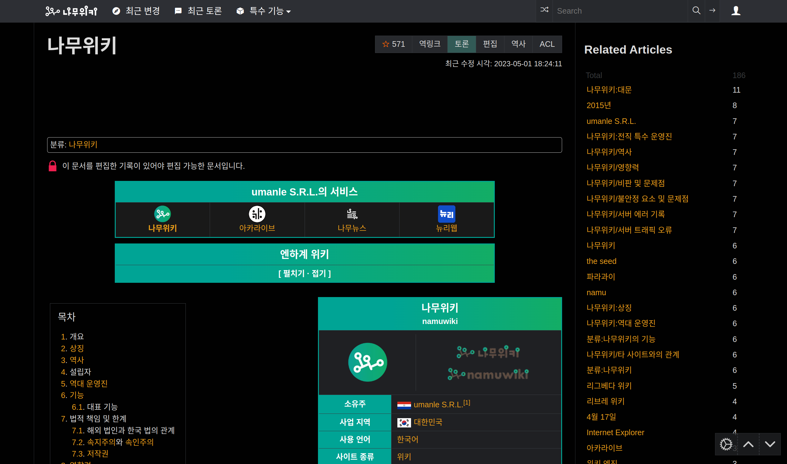

# Namuwiki Related Articles :deciduous_tree::arrow_right:

Automatically display related items on every [Namuwiki](namu.wiki) article page on the sidebar in order of their most mentioned occurrence.

## Installation

This is extension is not yet available in Chrome store.

### Manually build

1. Clone this repository
	```sh
	$ git clone https://github.com/abiriadev/namuwiki-related-articles
	$ cd namuwiki-related-articles
	```
	1. Enable [corepack](https://github.com/nodejs/corepack), if you haven't
		```sh
		$ corepack enable
		```
1. Install NPM dependencies
	```sh
	$ pnpm install
	```
3. Build extension
	```sh
	$ pnpm build
	```
4. Go to `chrome://extensions` page and make sure you have enabled developer mode. then click 'Load unpacked' button and select the `/dist` directory.

## Screenshots




## Features

- [x] Show total counts
- [x] Generate clickable links
- [ ] Limit visible items
	- [ ] Option page
	- [ ] Allow users to configure how many items to show
	- [ ] Allow users to configure to show only items mentioned more than a specified amount
	- [ ] Show/Hide button or make UI foldable
- [ ] Familiar design
	- [ ] Displays items even when the users have turned off the sidebar
	- [ ] Support other skins other than Senkawa
	- [x] Support dark mode
- [ ] Use Svelte rendering system
- [ ] Narrower permissions
- [ ] Parse RAW content rather than accessing DOM directly
- [ ] Support Firefox and Safari

### Known issues

- Content scripts can not be reloaded automatically when user clicked a link. currently working solution is to use observe DOM changes. - [chrome extension content script not working when url change but only works after refresh](https://stackoverflow.com/questions/71935684/chrome-extension-content-script-not-working-when-url-change-but-only-works-after) but it requires all site access, not a [static declarations](https://developer.chrome.com/docs/extensions/mv3/content_scripts/#static-declarative).

## License

This project is licensed under MIT license.

[](./LICENSE)